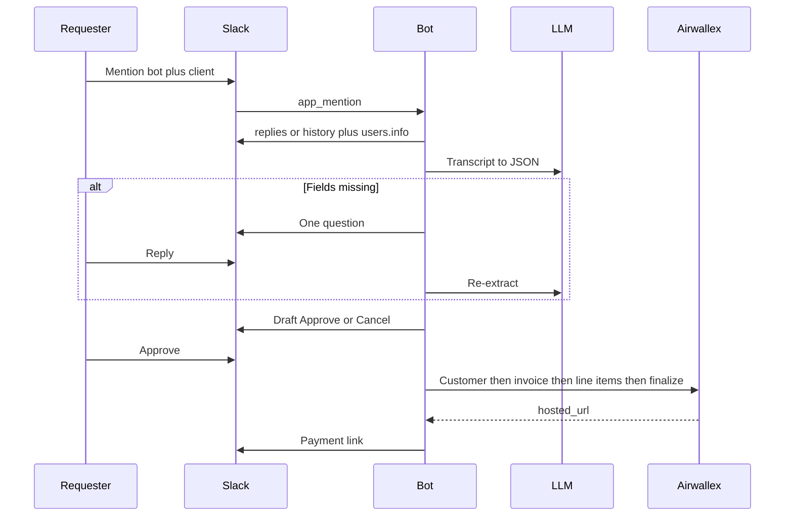

# User flow

## Happy path

1. A channel or thread already contains the project and a price (for example: “Website redesign for Acme, $5,000”).
2. Requester mentions the bot and tags the client: `@InvoiceBot send an invoice to @jordan`.
3. Bot reads the conversation (rules below), loads Slack profiles for requester and client, and sends the thread to the LLM.
4. If required fields are complete, bot posts a **draft card** in a thread (or the existing thread).
5. Requester clicks **Approve**.
6. Bot creates/reuses the Airwallex Billing Customer, creates a `DRAFT` invoice, adds one (or more) inline line items, finalizes, and posts `hosted_url` in the same thread.
7. If `EMAIL_ENABLED=true` and the client has a Slack email, bot also sends that link. v1 default is **off**.

## Missing fields

If the LLM reports `missing_fields`, the bot posts **one** clarifying question (`clarifying_question`) and waits for the next human message in that thread from anyone (typically the requester). It then re-extracts over the full thread (including the answer) and either asks again or posts the draft.

It does not ask a second question until the first is answered. It does not invent amount, client, or currency.

## Who can approve

Only the **requester** (the user who sent the original `app_mention`) can click Approve or Cancel. Other users see the card; their clicks get an ephemeral “Only `<requester>` can approve this draft.”

## Cancel

Cancel deletes the pending draft from the in-memory store and updates the Slack card to “Cancelled.” Airwallex is not called.

## Conversation scope

| Mention location | What the bot reads |
| --- | --- |
| Inside an existing thread (`thread_ts` set) | That thread only: `conversations.replies` on `thread_ts` |
| Top-level channel message (no `thread_ts`) | The mention message plus up to the last 50 channel messages (`conversations.history`) so a project discussed in-channel is visible. The bot **replies in a thread** on the mention message. All follow-ups and the draft live in that new thread |

Bot messages are included in the transcript (labeled as bot) so the LLM can see prior questions.

DMs: supported if the bot is in the DM and has `im:history`. Same thread rules.

## Client selection

From the mention text:

1. Collect user IDs mentioned in the message (`<@U…>`).
2. Drop the bot’s own user ID.
3. Drop the requester.
4. If exactly one remains → that user is the client.
5. If zero remain → ask: “Who should I invoice? Tag the client.”
6. If more than one remain → ask: “I see several people tagged. Who is the client?”

The client Slack user is required before a draft can be shown. Amount and description can come from the thread; the client cannot be inferred from names in prose.

## Draft card contents

The Slack draft is **not** an Airwallex `DRAFT` invoice. It is a Block Kit preview of what will be sent on Approve:

- Client display name (and email if present, or “no email on Slack profile”)
- Line items: description, quantity, unit/flat amount, currency
- Memo (if extracted)
- Totals as extracted (tax applied only if `AIRWALLEX_DEFAULT_TAX_PERCENT` is set; shown as “estimated”)
- Buttons: Approve, Cancel

After Approve, the card is updated to “Sending…” then “Invoice sent” with the `hosted_url`. After failure, the card shows the error and keeps Approve available if the draft is still in store.

## Concurrent drafts

One active draft per Slack thread (`channel` + `thread_ts`). A second mention in the same thread replaces the pending draft and tells the requester the previous one was superseded. Mentions in other threads are independent.

## Timeouts

Pending drafts expire after 60 minutes of inactivity (no Approve/Cancel and no clarifying reply). The bot does not auto-finalize.

## Errors the user should see

| Situation | Bot behavior |
| --- | --- |
| Bot not in channel | Slack will not deliver history; post that it needs to be invited |
| Client has no Slack email | Draft still allowed; note “link will only be posted in Slack” |
| Airwallex 4xx/5xx on Approve | Post the error message; do not claim the invoice was sent |
| LLM failure | Post “I couldn’t read this thread. Try again or add the amount and description explicitly.” |
| Missing Airwallex config | Fail at process start (do not start Bolt) |

## Sequence

